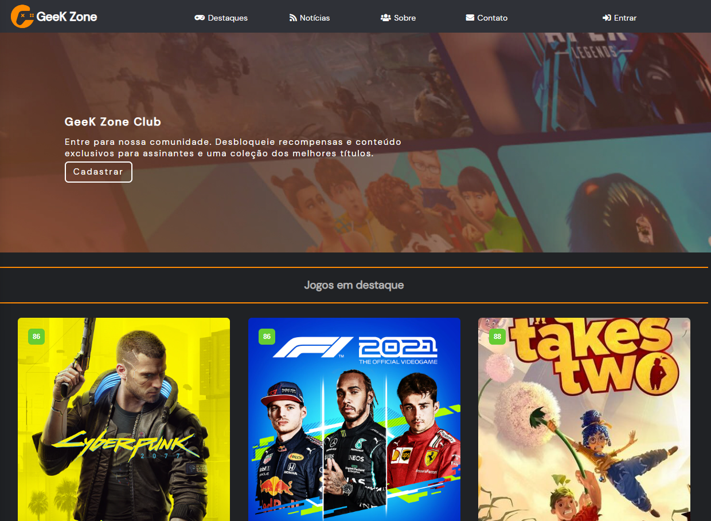
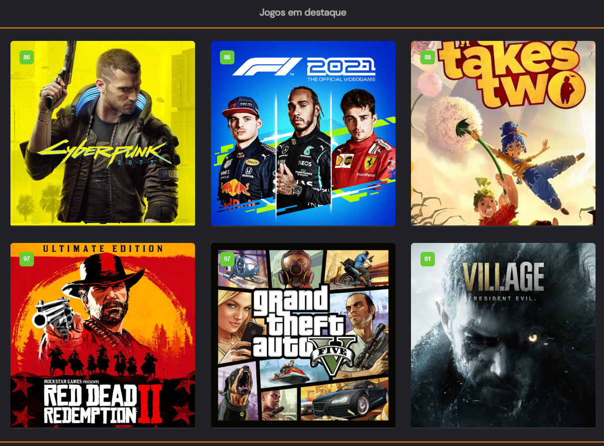
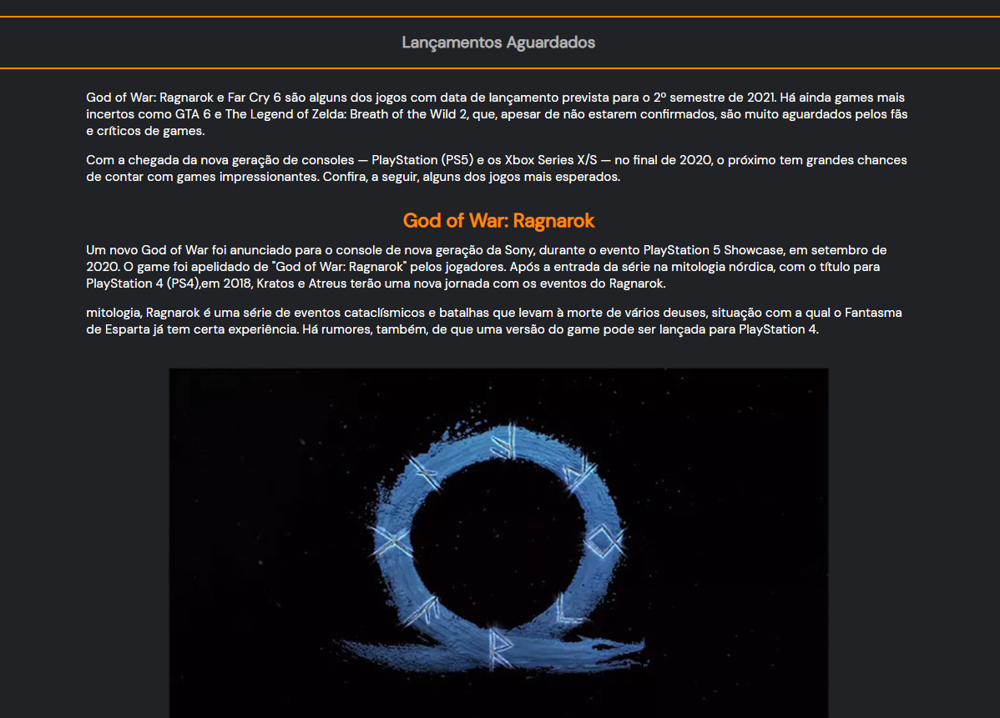
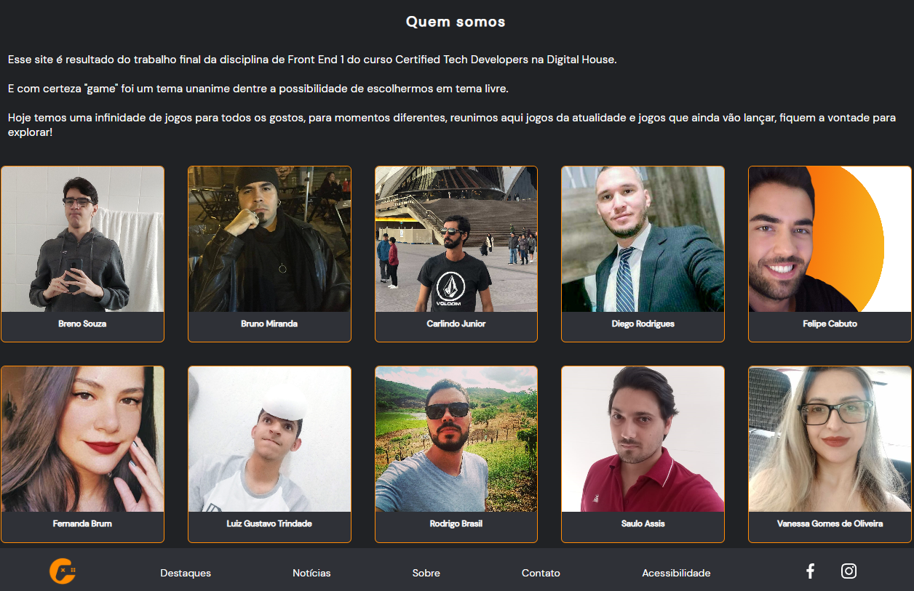
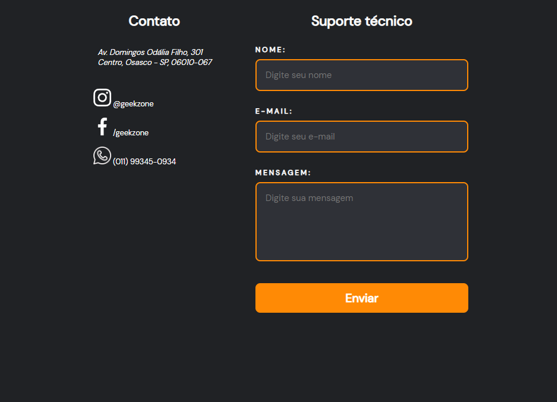
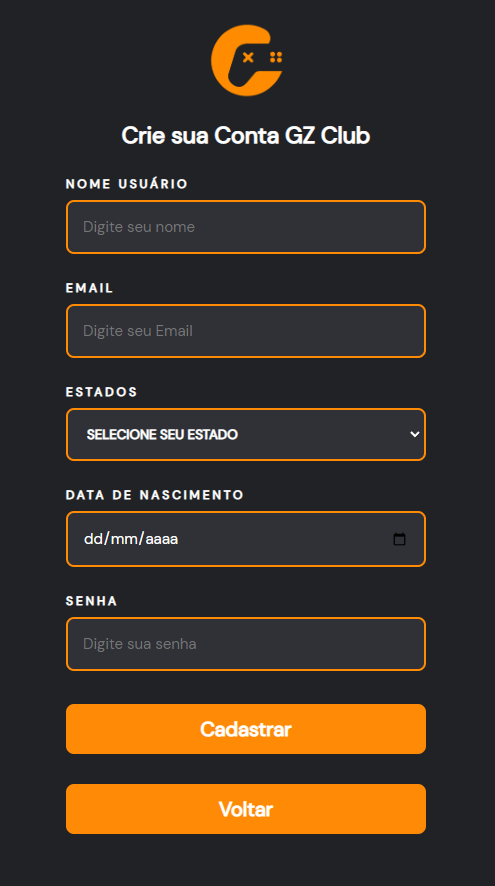
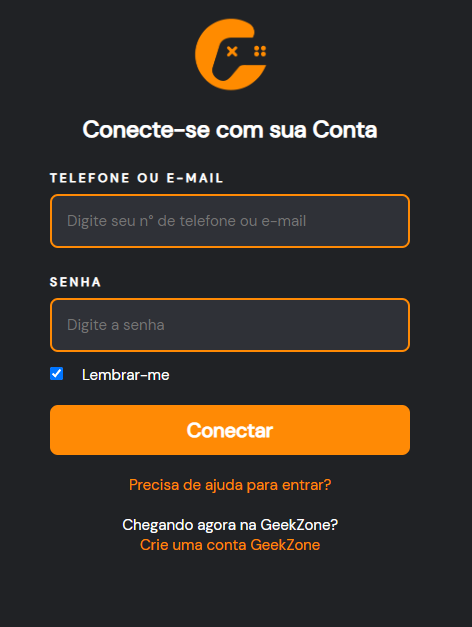

<h1 align="center">
     🎨<a href="#" alt="site DHFlix"> Projeto de Avaliação: Front End 1</a>
</h1>

<h3 align="center">
    🎮 Trabalho final de avaliação para a matéria de Front End 1 do Curso CTD da Digital House. Criação de um site de Games Chamado Geek Zone. 🎮
</h3>
<h3 align="center">
https://bbmiranda.github.io/DH-FrontEnd-CheckpointIFinal/
</h3>

<h4 align="center">
	🚧 Concluído 🚀 🚧
</h4>

Tabela de conteúdos
=================
<!--ts-->
  * [🖥️ Sobre o projeto](#sobre-o-projeto)
  * [⚙️ Funcionalidades](#funcionalidades)
  * [🎨 Layout](#layout)
    + [Home](#home)
    + [Destaques](#destaques)
    + [Notícias](#notícias)
    + [Sobre](#sobre)
    + [Contato](#contato)
    + [Cadastrar](#cadastrar)
    + [Login](#login)
    
  * [🚀 Como executar o projeto](#como-executar-o-projeto)
    + [Pre-requisitos](#pre-requisitos)
      - [🧭 Rodando a aplicacao web (Frontend)](#rodando-a-aplicacao-web--frontend-)
<!--te-->


## 🖥️ Sobre o projeto
![Sobre o Projeto]

O objetivo deste site é servir como uma interface para um suposto serviço de jogos, noticías, avaliações, destaques do universo Geek pra se manter antenado em quais jogos comprar e quais fazem mais o seu estilo como jogador.
Neste projeto o time aplicou os conhecimentos adquiridos na matéria ao longo do bimestre, como: transições e animações em css e as tags de HTML.

---

## ⚙️ Funcionalidades                                        

- [x] Representar uma pataforma serviço de jogos, noticías, avaliações, destaques do universo Geek pra se manter antenado em quais jogos comprar e quais fazem mais o seu estilo como jogador.
- [x] Os Usuários/Geekers teriam acesso as notícias sobre jogos da atualidade, suas avaliações, data de lançamentos, valores até mesmo futuramente efetur compras e  downloadas a partir do seu login.
- [x] Efetuar o cadasteo do site em "Cadastrar".
- [x] Entrar em contato com a suporte a partir do campo "Contatos" caso encontre algum problema ou sugestão de melhoria.
- [x] Acessar a área de jogos em "Destaque".
- [x] Acessar a área de notícias e se manter antenado sobre os principais lançamentos e jogos nos mais diversos console "Notícias".
- [x] Fazer seu login depois de efetuado o cadastro, para acessar as futuras melhorias do site "Login"
- [x] Saber quem foram os alunos que produziram o projeto

---

### Home


### Destaques


### Notícias


### Sobre


### Contato


### Cadastrar


### Login


---

## 🚀 Como executar o projeto
Este projeto possui apenas uma parte:

1. Frontend 
### Pre-requisitos

Antes de começar, você vai precisar ter instalado em sua máquina a seguinte ferramenta:
[Git](https://git-scm.com). 


#### 🧭 Rodando a aplicacao web (Frontend)

```bash
# Download deste repositório
https://bbmiranda.github.io/DH-FrontEnd-CheckpointIFinal.git

# Acesse a pasta do repositório na sua máquina

#Execute o arquivo
index.html

# A partir da página inicial, é possível acessar todas as outras por meio dos links e botões

```

---

## 🛠 Tecnologias

As seguintes ferramentas foram usadas na construção do projeto:

-  **[HTML](https://developer.mozilla.org/pt-BR/docs/Web/HTML)**
-  **[CSS](https://developer.mozilla.org/pt-BR/docs/Web/CSS)**
-  **[JavaScript](https://developer.mozilla.org/pt-BR/docs/Web/Javascript)**

---


---

Feito com ❤️ pelo grupo mais entrosado que você irá encontrar! 


